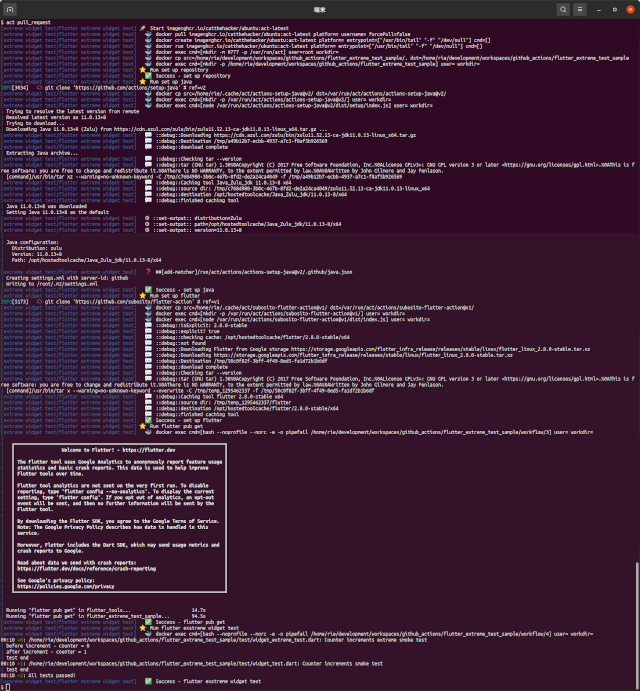
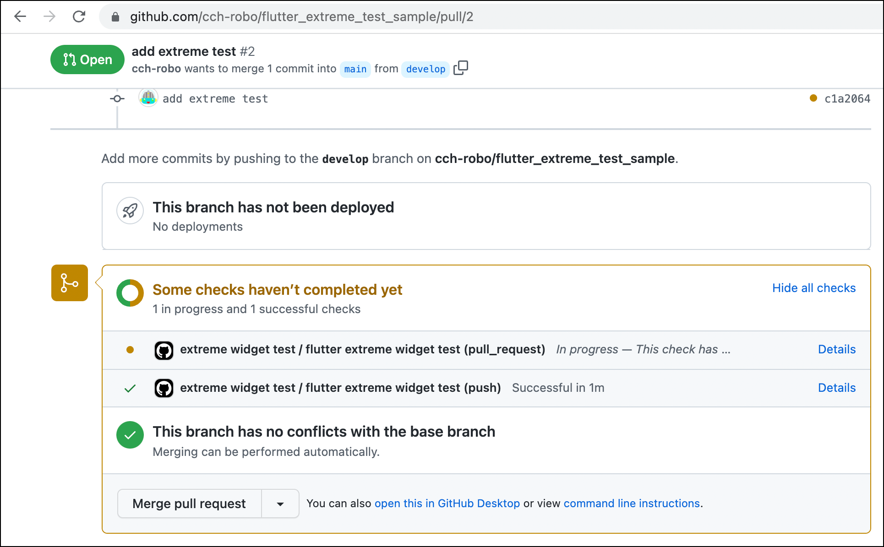
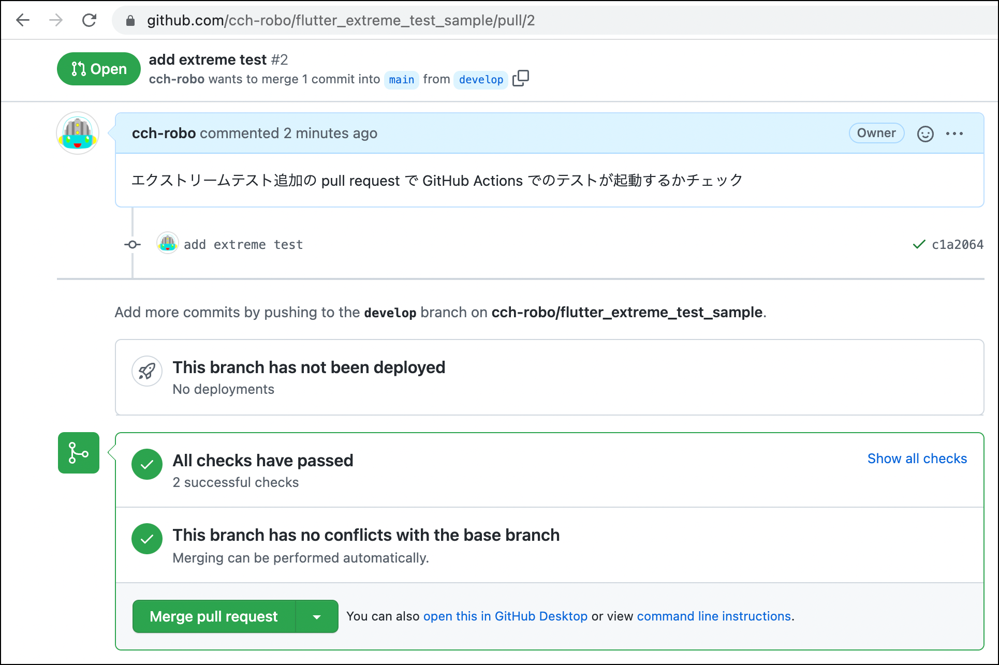
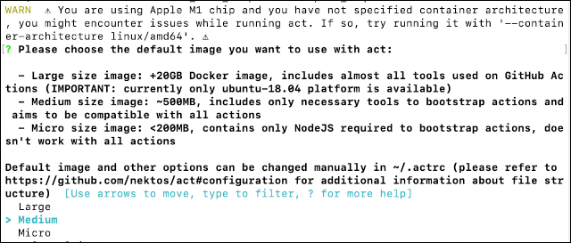
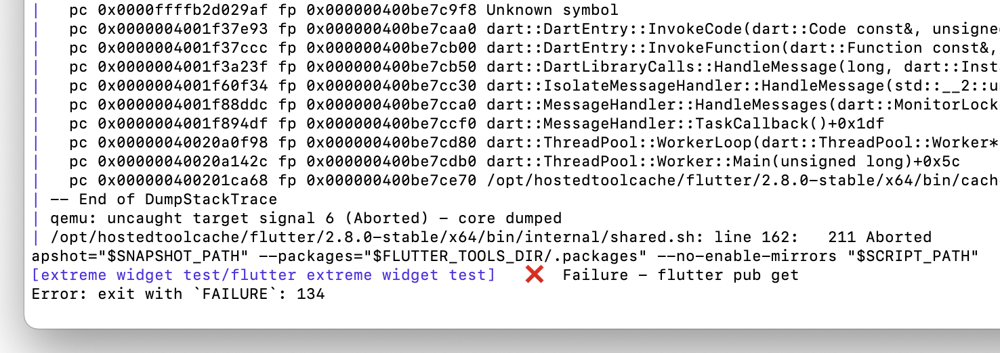
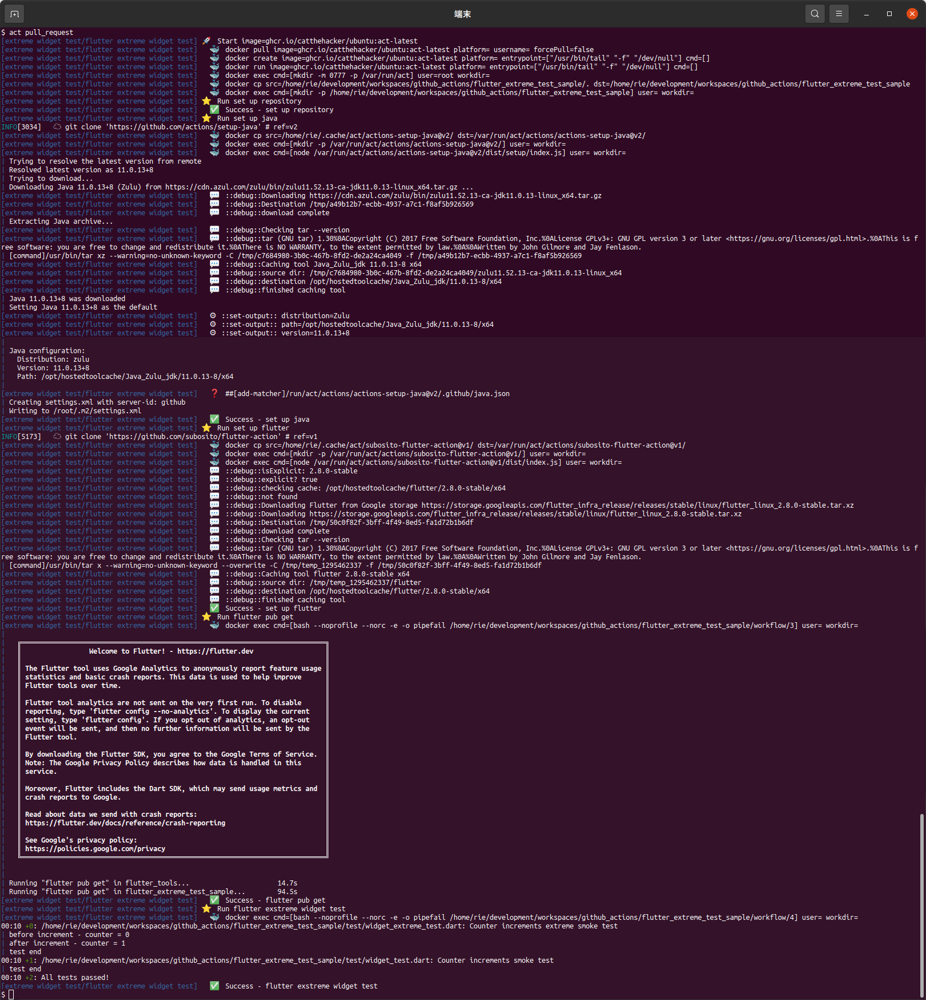
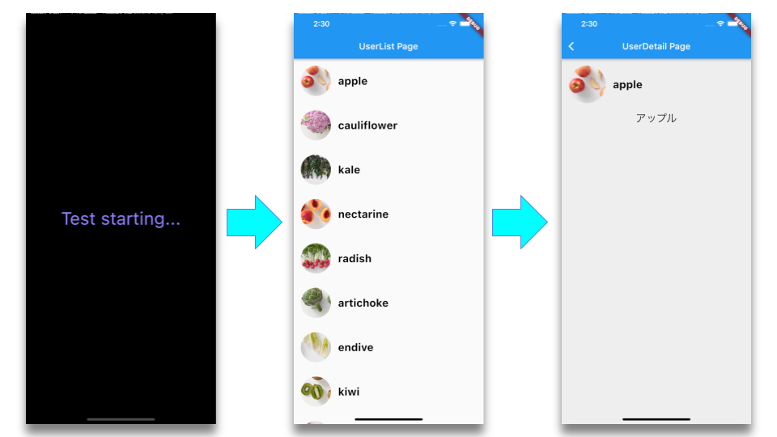
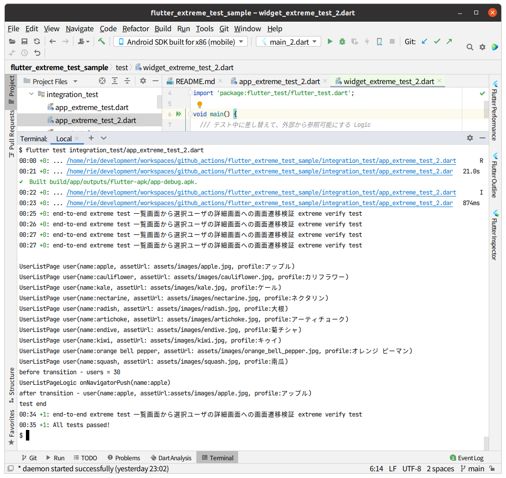
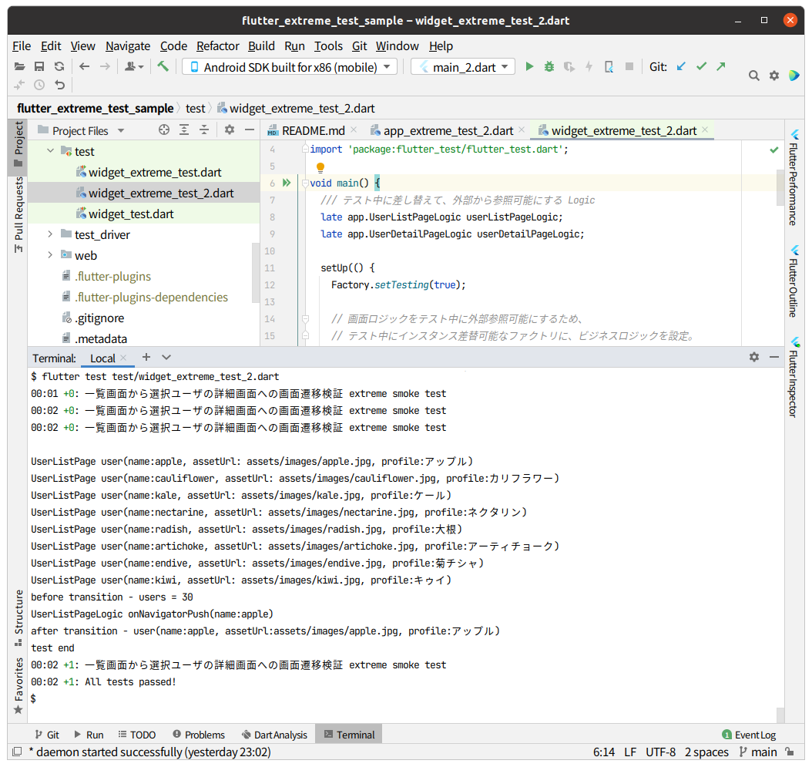

# [Flutter Advent Calendar 2021](https://qiita.com/advent-calendar/2021/flutter) | Calendar2 day15

## はじめに
このドキュメントは、[Flutter Advent Calendar 2021](https://qiita.com/advent-calendar/2021/flutter) のカレンダー2の day15
です。

[DevFest Kyoto 2021 - Flutterテスト講座](https://gdgkyoto.connpass.com/event/226491/) の
セッション [**テスト設計できるようになろう**](https://drive.google.com/file/d/1OznsKYxa_VSkrAwuH2cqpf1ZHxBNsLEg/view?usp=sharing) の  
*Widget testで状態プロパティを参照する - エクストリームテスト* の [**サンプルプロジェクト**](https://github.com/cch-robo/flutter_extreme_test_sample) をベースに、  
[GitHub Actions](https://docs.github.com/en/actions) を使い、Pull requestイベントで `flutter test test/`を実行するようにしたレポートです。  
セッション内容については、スライド資料を御参照ください。

* セッション発表スライド  
  [テスト設計できるようになろう](https://drive.google.com/file/d/1OznsKYxa_VSkrAwuH2cqpf1ZHxBNsLEg/view?usp=sharing)

Flutterプロジェクト-リポジトリの [GitHub Actions](https://docs.github.com/en/actions) 対応については、  
[*flutter github actions*](https://www.google.com/search?q=flutter+github+actions&oq=flutter+github+actions&ie=UTF-8) でググれば、既に多くの方々が資料を公開されていますので、  
レポートでは、主に [**nektos/act**](https://github.com/nektos/act) を使ったローカルでの GitHub Actions ワークフロー実行について紹介します。

  
**act によるローカル GitHub Actions ワークフロー実行例**


## GitHub Actions 設定

[Quickstart for GitHub Actions - GitHub Docs](https://docs.github.com/en/actions/quickstart) に従い、GitHub Actions ワークフローを作ります。

1. GitHubのリポジトリに `.github/workflows` ディレクトリを作成します。

2. [yaml](https://ja.wikipedia.org/wiki/YAML) 形式でタスクを記述する任意名の`ワークフローファイル`を追加します。  
*Widget testを実行させるので `extreme_widget_test.yml` としました。*

3. ワークフローファイルに CI/CD ⇒ 継続的インテグレーション/継続的デリバリーのタスクを記述します。  
*Pull Requestイベントで、flutter環境を構築して`flutter test test/`を実行するタスクを記述しました。*

4. その他、GitHub Actionsの詳細については、[Learn GitHub Actions - GitHub Docs](https://docs.github.com/en/actions/learn-github-actions) を参照下さい。


- 作成したワークフロー  
*プロジェクト* / [.github](https://github.com/cch-robo/flutter_extreme_test_sample/tree/main/.github) / [workflows](https://github.com/cch-robo/flutter_extreme_test_sample/tree/main/.github/workflows) /
[extreme_widget_test.yaml](https://github.com/cch-robo/flutter_extreme_test_sample/blob/main/.github/workflows/extreme_widget_test.yml)  
Pull Requestイベントが発生すれば、`flutter test test/` を実行します。
  - `steps:`の設定は、[subosito/flutter-action](https://github.com/subosito/flutter-action) の [README.md](https://github.com/subosito/flutter-action/blob/master/README.md) にある [Usage](https://github.com/subosito/flutter-action/blob/master/README.md#usage) サンプルを参考にしました。

```yaml
name: extreme widget test

on:
  pull_request:
    types: [opened, synchronize]
jobs:
  extreme_widget_test:
    name: flutter extreme widget test
    runs-on: ubuntu-latest
    timeout-minutes: 15
    steps:
      - name: set up repository
        uses: actions/checkout@v2
      - name: set up java
        uses: actions/setup-java@v2
        with:
          distribution: 'zulu'
          java-version: '11'
      - name: set up flutter
        uses: subosito/flutter-action@v1
        with:
          channel: 'stable'
          flutter-version: '2.8.0'
      - name: flutter pub get
        run: flutter pub get

      # 全てのエクストリームWidgetテストを実行
      - name: flutter exstreme widget test
        run: flutter test test/
```


## pull request で `flutter test test/` が実行されるかチェック

### GitHub (GitHub Actions)

- Pull Request イベントとともにテストが実行されるようになり  


- テスト成功で Merge 可能になりました。  



## ローカルでの GitHub Actions ワークフロー実行

### act とは何か

- **[nektos/act](https://github.com/nektos/act) リポジトリ**  
[https://github.com/nektos/act](https://github.com/nektos/act)


- 概要  
  - act は、ローカルで GitHub Actions の ワークフローを実行させるコマンドラインツールです。  
  - act は、コマンド実行されたカレントディレクトリにある  
  `.github/Workflows/`から GitHub Actions のワークフロー yml を読み込みんでタスクを実行します。  
 

- 詳細
  - その実態は、act コマンドにより疑似 GitHub Actions システム実行環境を起動して、  
  カレントディレクトリの ワークフロー yml を読み込み、続くオプション指定により、疑似実行環境への環境設定や、  
  疑似実行環境へのイベントトリガーを発行させることのできるコマンドラインツールです。


- サンプルリポジトリ  
  [https://github.com/cplee/github-actions-demo](https://github.com/cplee/github-actions-demo) は、GitHub Actions ワークフローを含んだリポジトリです。  
  act を使えば、下記のアニメーションのように GitHub Actions ワークフローがローカルで実行されます。
    


### docker インストール (act をインストールする前に)

- act は、ワークフローを実行するために` docker`に依存しています。  
下記の公式資料に従って、各プラットフォーム用の docker 環境を構築しておいて下さい。  
  - macOS ⇒ [https://docs.docker.com/docker-for-mac/install/](https://docs.docker.com/docker-for-mac/install/) に従って Docker Desktop for Mac をインストールしてください。
  - Linux ⇒ [https://docs.docker.com/engine/install/](https://docs.docker.com/engine/install/) に従って、Docker Engine ⇒ docker-ce をインストールしてください。


- macOS への Docker Desktop インストール  
`Docker.dmg`ファイルをダウンロードして、`Applications` にインストールするだけです。  


- Ubuntu 20.04 LTS への docker-ce インストール資料
  - Install Docker Engine（Docker Community Edition）  
    [https://docs.docker.com/engine/install](https://docs.docker.com/engine/install)

  - Install Docker Engine on Ubuntu  
    [https://docs.docker.com/engine/install/ubuntu/](https://docs.docker.com/engine/install/ubuntu/)

```text
上記の資料に従った、Ubuntuへの docker-ce インストール手順

1. Uninstall old versions  
   $ sudo apt-get remove docker docker-engine docker.io containerd runc  

2. Set up the repository  
   $ sudo apt-get update  
   $ sudo apt-get install ca-certificates curl gnupg lsb-release  

3. Add Docker’s official GPG key:
   $ curl -fsSL https://download.docker.com/linux/ubuntu/gpg | sudo gpg --dearmor -o /usr/share/keyrings/docker-archive-keyring.gpg

4. 安定版リポジトリを選択
   $ echo \
     "deb [arch=$(dpkg --print-architecture) signed-by=/usr/share/keyrings/docker-archive-keyring.gpg] https://download.docker.com/linux/ubuntu \
     $(lsb_release -cs) stable" | sudo tee /etc/apt/sources.list.d/docker.list > /dev/null

5. Install Docker Engine
   $ sudo apt-get update
   $ sudo apt-get install docker-ce docker-ce-cli containerd.io

6. インストール確認
   $ docker --version
   Docker version 20.10.11, build dea9396
```   

- 【補足】Ubuntu 標準パッケージでのインストールと、docker.io とdocker-ce の違いについて  
  - [Ubuntu の docker.io と、Docker の docker-ce の違い](https://teratail.com/questions/340682?link=qa_related_sp) ⇒ [https://teratail.com/questions/340682?link=qa_related_sp](https://teratail.com/questions/340682?link=qa_related_sp)  
  - docker-ce は、Docker が開発しているので最新版になる。  
  - docker.io は、Ubuntu が管理しているの Ubuntuでの安定性があるが最新版ではない。  


### 各プラットフォーム用の act インストールコマンド。

- **[nektos/act](https://github.com/nektos/act) リポジトリ** の [README.md](https://github.com/nektos/act#readme) にインストールコマンドが紹介されています。  
  - Mac: `$ brew install act`  
  - Bash script (Mac/Linux): `$ curl https://raw.githubusercontent.com/nektos/act/master/install.sh | sudo bash`  
  - Manual download: 
    - [https://github.com/nektos/act/releases/latest](https://github.com/nektos/act/releases/latest) から、  
    各環境用の gz ファイルをダウンロードして展開し、展開先を PATH に追加します。  
    *リリース済のビルドイメージ置場 ⇒ [https://github.com/nektos/act/releases](https://github.com/nektos/act/releases)*  


- Ubuntu への act インストールについての備考  
`$ curl https://raw.githubusercontent.com/nektos/act/master/install.sh | sudo bash` を実行すると、  
tarボールのローカルへのダウンロード＋展開が行われて、`/usr/local/bin/`に `act`実行ファイルがインストールされます。
  - ダウンロード元の tarボール ⇒ [https://github.com/nektos/act/releases/download/v0.2.25/act_Linux_x86_64.tar.gz](https://github.com/nektos/act/releases/download/v0.2.25/act_Linux_x86_64.tar.gz)  
  - インストール先 ⇒ `/usr/local/bin/`に、実行ファイル `act` がインストールされる。

```bash
# インストール確認
$ act --version
act version 0.2.25

$ which act
/usr/local/bin/act
```


### act コマンドを使ってみる。

- act コマンドでの引数について  
act コマンドは、`act [<event>] [options]` のフォーマットを取り、  
event には、yml ファイル(ワークフロー)の `on:` で定義した、`push:`や `pull_request:`などの GitHub イベントを与えます。  
options には、`act ｰl` ⇒ デフォルトアクション一覧や、`act -j test` ⇒ test jobを実行などがあります。  
*イベントやオプションがない場合、デフォルト値として push イベントが割り当てられます。*  
*詳細については、[Example commands](https://github.com/nektos/act#example-commands) ⇒ [https://github.com/nektos/act#example-commands](https://github.com/nektos/act#example-commands) を参照下さい。*  


- *ちなみに本件のワークフローでは、`$ act pull_request` コマンドでテストが実行されます。*


- act 実行時には、以下のような WARN警告や 選択を促されることがあります。  



- WARNと選択要求の概要
  - ⚠ You are using Apple M1 chip and you have not specified container architecture, you might encounter issues while running act.  
    If so, try running it with '--container-architecture linux/amd64'. ⚠  
    M1 macで問題がある場合は、下記例のように linux/amd64 コンテナアーキテクチャを強制指定してみてください。  
    `$ act pull_request --container-architecture linux/amd64`  

  - Please choose the default image you want to use with act:  
  デフォルトのイメージサイズの選択を要求されるので Medium を選択します。  
    - Large size image: ⇒ +20GB Docker image (全部入り)  
    - Medium size image: ⇒ 500MB以下 (こちらを選択します)  
    - Micro size image: ⇒ 200MB未満  
    - Default image and other options can be changed manually in ~/.actrc  
    *デフォルト設定は、`~/.actrc`に保管されます。*  


- act の設定ファイル  
  `~/.actrc` に選択したイメージサイズが設定されます。  
  *このファイルを削除すると、再度イメージサイズ選択が行われるようになります。*  
  *ただし他のオプション設定も一緒に消えることになります。*  

`~/.actrc`ファイルの設定例
```text
-P ubuntu-latest=ghcr.io/catthehacker/ubuntu:act-latest
-P ubuntu-20.04=ghcr.io/catthehacker/ubuntu:act-20.04
-P ubuntu-18.04=ghcr.io/catthehacker/ubuntu:act-18.04
```

- 【補足】act コマンド実行時に `unix /var/run/docker.sock: connect: permission denied` となる場合の対処  
  docker コマンド実行に sudo が必要な場合、そのままでは Permission denied が発生するのでエラーとなります。  
  この場合は、docker グループにユーザーを所属させれば回避できます。  
  - [ubuntu版Dockerを毎回sudoなしで実行したい](https://qiita.com/ITF_katoyu/items/1bdaaad9f64af86bbfb7)

```bash
# グループへのユーザー所属のない状況で、sudo なしで実行
$ docker images
# permission denied とされてエラーになる。

# docker グループ確認（ユーザーの所属なし）
$ getent group docker
docker:x:998:

# docker グループにユーザー(robo)を所属させる。（実行時にパスワード入力が求められます）
$ sudo gpasswd -a robo docker

# docker グループ確認（ユーザー所属あり）
$ getent group docker
docker:x:998:robo

# PC再起動後に実行
$ docker images
REPOSITORY   TAG       IMAGE ID   CREATED   SIZE

# 注意）docker グループに自分を所属させるためセキュリティ的に問題があります。
# gpasswd コマンドの詳細や、ユーザーをグループから外すには下記を参照下さい。
#【 gpasswd 】コマンド――ユーザーが所属するグループを管理する
# https://atmarkit.itmedia.co.jp/ait/articles/1612/12/news016.html
```


- act コマンド実行時の留意事項  
  - 初回実行時には、1GB ほどのイメージ・ダウンロードが発生しました。
  - act がダウンロードしている、Ubuntu のイメージ保管先  
  [catthehacker/docker_images](https://github.com/catthehacker/docker_images) ⇒ [https://github.com/catthehacker/docker_images](https://github.com/catthehacker/docker_images)  


- **私の macOS環境では、act による GitHub Actions ローカル実行に成功していません。**  
  Ubuntu 20.04 LTS環境(Intel cpu)では、問題なく act によるローカル実行に成功しましたが、  
  残念ながら私の M1 Macbook環境では、`flutter pug get`タスクでエラーが発生して終了するため、  
  ローカルでの GitHub Actions ワークフロー実行に成功していないことを補足いたします。  
  


### act によるローカル GitHub Actions ワークフロー実行

- **act によるローカル GitHub Actions ワークフロー実行**  
本件のワークフローでは、`pull_request:`イベントをトリガーに指定していますので、  
ターミナルで `$ act pull_request` のようにオプションでイベントを指定すれば、  
以下のように **ローカルでの GitHub Actions ワークフロー実行** が行われます。

  


- **ローカル GitHub Actions ワークフロー実行での Widget test 成功の確認**  
ターミナル出力の末尾には、`flutter exstreme widget test`タスクの 起動`Run` 〜 テスト成功`Success` までが出力されています。  
```shell
[extreme widget test/flutter extreme widget test] ⭐  Run flutter exstreme widget test
[extreme widget test/flutter extreme widget test]   🐳  docker exec cmd=[bash --noprofile --norc -e -o pipefail /home/rie/development/workspaces/github_actions/flutter_extreme_test_sample/workflow/4] user= workdir=
00:10 +0: /home/rie/development/workspaces/github_actions/flutter_extreme_test_sample/test/widget_extreme_test.dart: Counter increments extreme smoke test                                             
| before increment - counter = 0
| after increment - counter = 1
| test end
00:10 +1: /home/rie/development/workspaces/github_actions/flutter_extreme_test_sample/test/widget_test.dart: Counter increments smoke test                                                             
| test end
00:10 +2: All tests passed!                                                                                                                                                                            
[extreme widget test/flutter extreme widget test]   ✅  Success - flutter exstreme widget test
```


## エクストリームテストについて

- エクストリームテストとは、[**テスト設計できるようになろう**](https://drive.google.com/file/d/1OznsKYxa_VSkrAwuH2cqpf1ZHxBNsLEg/view?usp=sharing) での独自用語です。  
アプリコード内に「テスト中にコンポーネントツリー内の任意オブジェクトを  
外部参照可能なオブジェクトに差し替えられる」[**独自Factory**](https://github.com/cch-robo/flutter_extreme_test_sample/blob/main/lib/swappable_instance_factory.dart) を導入することで、  
Widget test や Integration test の中で、テストダブルの注入やコンポーネント状態の  
確認ができるようにした Extreme ⇒ 極端なテストを表します。  
　  
*Riverpodを使っているのでしたら、*  
*当該テスト用のウィジェットツリーとして、ProviderScope()の overrides: オプション引数で*  
*クロージャ内の必要なproviderオブジェクトを上書きしたルートウィジェットを作っても良いでしょう。*  
See [Overriding the behavior of a provider during tests.](https://riverpod.dev/docs/cookbooks/testing/#overriding-the-behavior-of-a-provider-during-tests)


- `flutter test integration_test/app_extreme2_test.dart` ⇒ エミュレータでの integration test 実行状況。  
integration test 起動画面から一覧画面が表示され、リスト上端の appleを選択して、詳細画面に遷移するかを確認しています。
  


- 【留意事項】エクストリームテストでは、integration test と widget test で同一内容のテストが行えます。  
アプリコード自体が、テスト中のコンポーネントツリー内ノードの差し替えを可能にさせているエクストリームテストでは、  
Widget test であってもアプリのコンポーネントツリー内の任意ノード ⇒ オブジェクトにアクセスできるので、  
アプリの実行環境 ⇒ アプリのコンポーネントツリーを使ってテストを行う Integration test と同様のテストが行なえます。  
*一覧画面から詳細画面を開く `main2.dart` の Integration test と Widget test は、同じテストコードにしていますので御確認下さい。*  
  - [main2.dart](https://github.com/cch-robo/flutter_extreme_test_sample/blob/main/lib/main_2.dart)  
  - [integration_test/app_extreme2_test.dart](https://github.com/cch-robo/flutter_extreme_test_sample/blob/main/integration_test/app_extreme2_test.dart)  
  - [test/widget_extreme2_test.dart](https://github.com/cch-robo/flutter_extreme_test_sample/blob/main/test/widget_extreme2_test.dart)  
  - [独自Factory](https://github.com/cch-robo/flutter_extreme_test_sample/blob/main/lib/swappable_instance_factory.dart) ⇒ [lib/swappable_instance_factory.dart](https://github.com/cch-robo/flutter_extreme_test_sample/blob/main/lib/swappable_instance_factory.dart)  


- 【留意事項】エクストリームテストで、integration test と widget test で同一内容のテストが行わることの確認。  
`main2.dart` の Integration test と Widget test で同じテストが行われていることは、ログ出力の一致で確認できます。  
*勿論制限がありますが、エミュレータ起動を伴わないコンテナサーバ上での CI/CD テストへの応用を考えたいですね。*  


- `main2.dart` Integration test のログ出力  
  


- `main2.dart` Widget test のログ出力  
  


## 希望的観測

- **CI/CD ワークフロー作成のための布石**  
  flutter開発プロダクトが成長していくようになった昨今、自動テストとデプロイは益々重要になっていくと思います。  
  act を使えば、flutter 環境においてもローカルでの GitHub Actions ワークフローが実行できることが確認できました。  
  これで GitHub Actions 動作確認のためだけの無為な `push`や `pull request`なしに、CI/CD ワークフローを試せそうです。  


## まとめ

セッション [**テスト設計できるようになろう**](https://drive.google.com/file/d/1OznsKYxa_VSkrAwuH2cqpf1ZHxBNsLEg/view?usp=sharing) の  
*Widget testで状態プロパティを参照する - エクストリームテスト* の [**サンプルプロジェクト**](https://github.com/cch-robo/flutter_extreme_test_sample) をベースに、  
[GitHub Actions](https://docs.github.com/en/actions) と [nektos/act](https://github.com/nektos/act) を使い、Pull requestイベントで `flutter test test/`を実行するようにしたレポートは以上です。  


## 謝辞

- このレポート作成に当たり、以下の資料を参照いたしました。
  - [GitHubの新機能「GitHub Actions」で試すCI/CD](https://knowledge.sakura.ad.jp/23478/)
  - [Flutterの自動ビルドをGithub ActionsとFirebaseで行う](https://zenn.dev/qst/articles/39e893b94d26f3eba855)
  - [GitHub ActionsによるFlutterテスト](https://zenn.dev/okuzawats/books/say-hello-to-fluter-ci-cd-with-github-actions/viewer/1-test)
  - [【Flutter】3種類のテストをGithub Actionsで自動化する](https://hondakenya.work/flutter-test-github-actions/)
  - [【Flutter】GitHubActionsでテストと静的解析を自動化する](https://qiita.com/tokkun5552/items/2eb6793501c152dabf33)
  - [FlutterアプリをGitHub Actionsを使用してFirebase App Distributionにデプロイしてみよう！](https://qiita.com/oke331/items/52e4bf32dc10a7054cca)
  - [【Flutter】GitHub Actions で iOS 向けに自動デプロイする](https://zenn.dev/pressedkonbu/articles/254ca2fc3cd1ab)
  - [GitHub ActionsでiOSのプロジェクトをビルドしたい！](https://ulog.sugiy.com/github-actions-ios-build/)
  - [GitHub ActionsでiOSアプリのCI環境を構築する方法](https://qiita.com/uhooi/items/29664ecf0254eb637951)
  - [GitHub Actions で Xcode プロジェクトをビルドしてみる](https://zenn.dev/koogawa/articles/54ff450a6dc5fd)
  - [GitHub Actionsのローカル実行ツール「act」を使う事でCI/CDコンフィグとローカルでのタスクランナーを1つにする](https://dev.classmethod.jp/articles/act-for-github-actions-local-execution-tool/)
  - [【ACT】GitHub Actions のローカル実行ツール使ってみた](https://qiita.com/wwalpha/items/6c303dcf04e236238315)
  - [GitHub Actions を act でローカルテストする](https://vlike-vlife.netlify.app/posts/testtool_act)
  